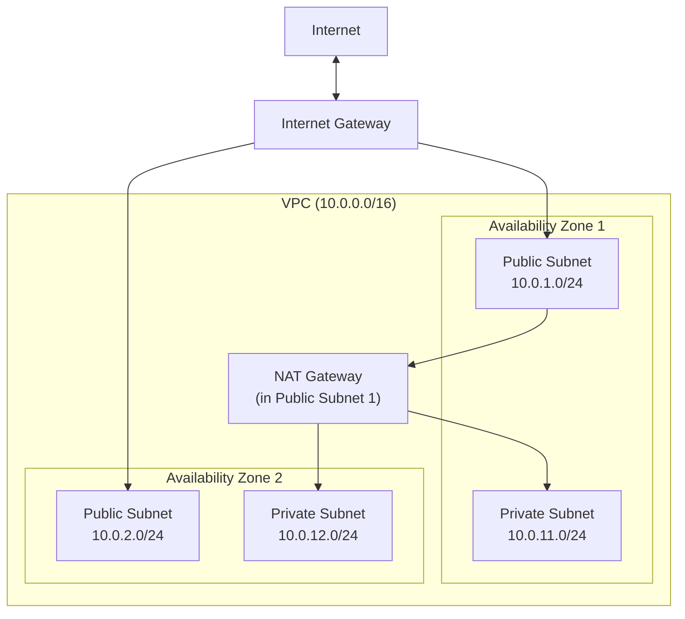
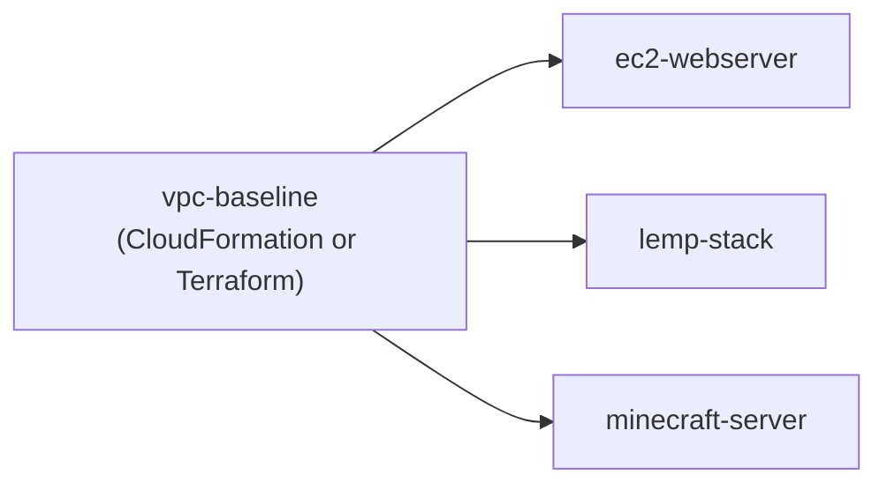

# Architecture Overview

## VPC Baseline

The VPC baseline template provisions the network foundation all other stacks
deploy into. Two AZs, public and private subnets in each, a single NAT
Gateway in the first public subnet for private subnet egress.

## Stack Dependency Map

The `ec2-webserver`, `lemp-stack`, and `minecraft-server` stacks all
import VPC and subnet IDs from the `vpc-baseline` stack via CloudFormation
cross-stack exports (`!ImportValue`). Deploy `vpc-baseline` first in any
environment before deploying the others.

## Cost Estimate (us-west-2, on-demand, approximate)

| Resource | Type | $/hr | Notes |
|---|---|---|---|
| NAT Gateway | - | $0.045 | Plus $0.045/GB data processed |
| EC2 webserver | t3.micro | $0.0104 | Free tier eligible (750 hrs/mo first year) |
| EC2 LEMP | t3.micro | $0.0104 | Free tier eligible |
| EC2 Minecraft | t3.medium | $0.0416 | Needs 2+ GB RAM |
| EBS (world data) | gp3, 10 GB | ~$0.008/day | $0.08/GB/month |

For a dev/portfolio environment running a few hours of testing: under $1
total. The NAT Gateway is the only resource that costs money while idle
(~$1.08/day). Tear the VPC stack down between sessions if cost is a concern.
